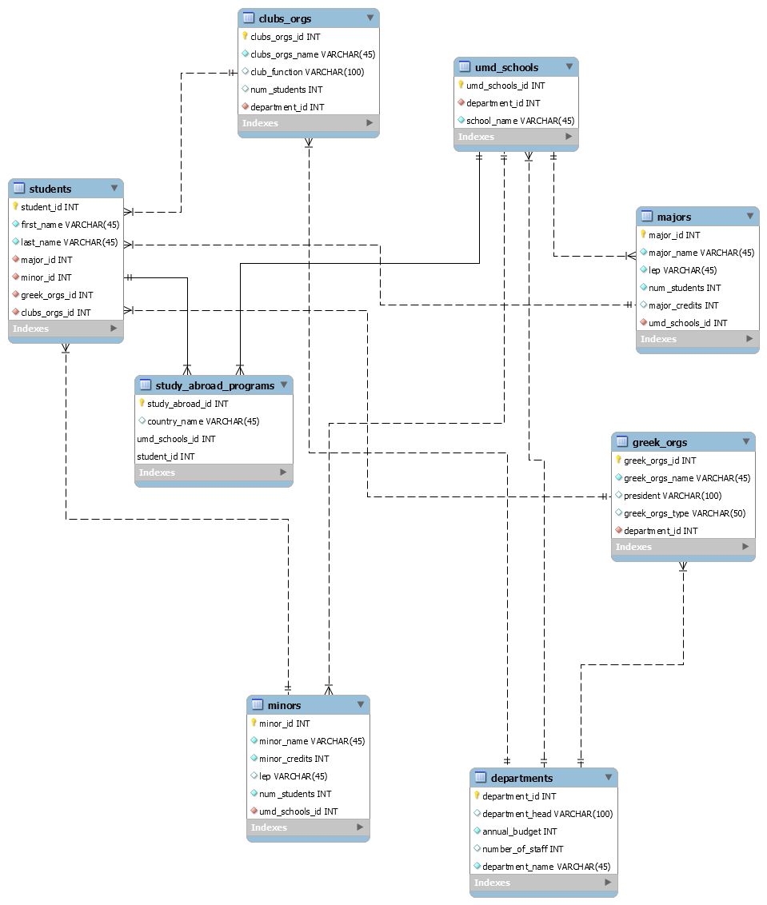

# UMD Departments Relational Database
For this project, my goal is to build a relational database that showcases the different functions and structures of each individual department at UMD. The relational database will also highlight the relationships among the different departments as well as their individual characteristics. 

This project is comprised of an ERD model and eleven SQL queries. The created ERD Model showcases the different relationships between the eight entities that represent UMD’s infrastructure. I then forward engineered my ERD Model and stored the sample data from a csv file I created containing information about the different UMD different departments into each of the eight different entities from my ERD Model. 

The eleven created SQL queries were based on hypothetical questions designed to highlight the relationships between each entity. Each SQL query was created as a view so that when a user downloads the backup file they are able to see the queries as well.

# ERD Model

# The eleven SQL queries

